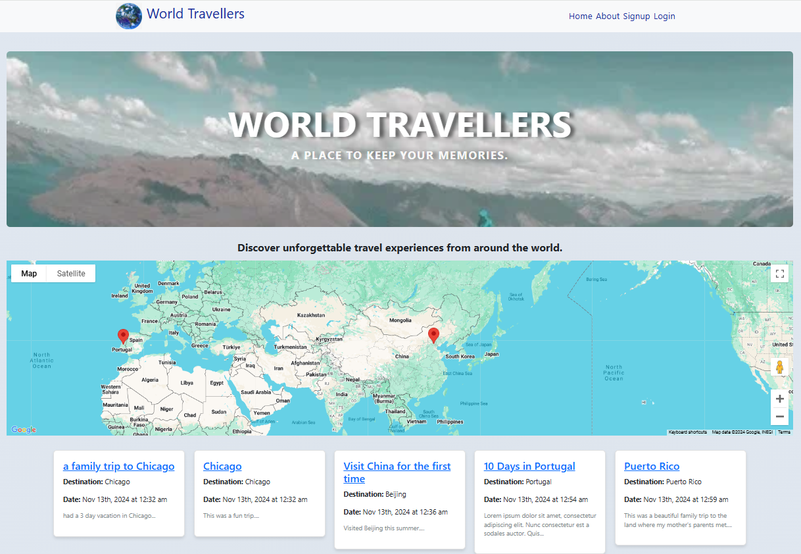
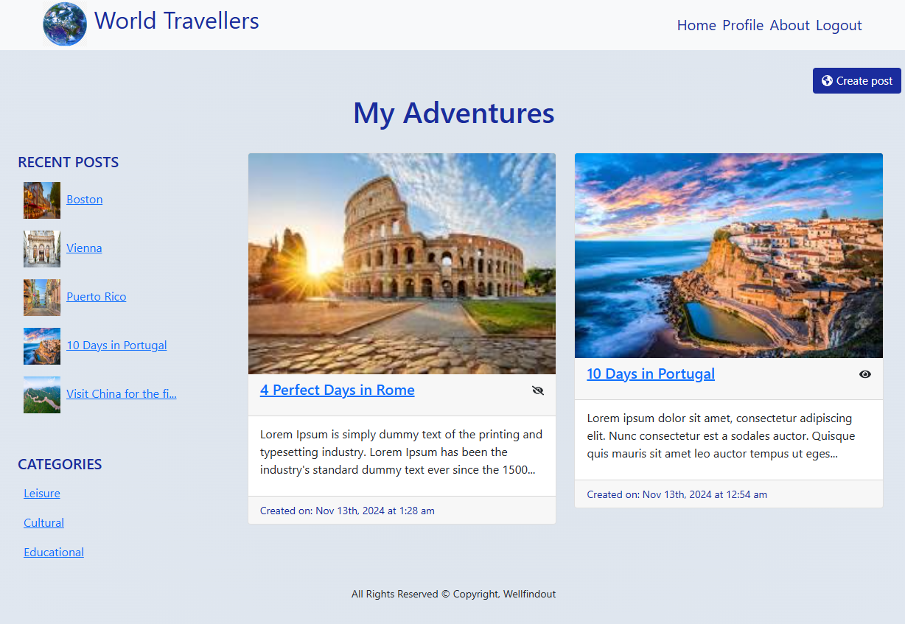

# Travel Blog

## Description
The travel blog project is designed to allow passionate travelers to create and share their travel experiences, stories, and tips. Users can craft detailed blog posts with titles, content, and images, making their adventures easily accessible and engaging for readers. The platform includes features such as editing and deletion of blog post, uploading images within their blog posts, categorizing their posts for easy navigation, and a responsive design for both desktop and mobile use.

## User Story

**Title**: User can create and share travel experiences.

As a passionate traveler and blogger, I want to create and share my travel experiences, stories, and tips on a blog, so that I can inspire and inform others about different travel destinations.

**Acceptance Criteria:**

- **Blog Creation:** The user can create a new blog post with a title, content, and images.

- **Image Upload:** The user can upload and manage images within their blog posts.

- **Category:** The user can categorize their posts for easy navigation and searchability.

- **Responsive Design:** The blog is accessible and visually appealing on both desktop and mobile devices.

## Table of Contents
* [Installation](#installation)
* [Tech Used](#stack)
* [Functionality](#functionality)
* [Goals Accomplished](#goalsaccomplished)
* [Review](#review)
* [Contact](#contact)

## Installation
Clone this project repository to your computer.
Use the terminal to run the commands:
- navigate to the client folder, use the command "npm install" to install application dependecies, and the command "npm run dev" to start the client;
- navigate to the server folder, use the command "npm install" to install application dependecies, and use the command "npm run watch" to start.
    

## Tech Used 
Built using the following technologies:
- React for the front end.
- GraphQL with a Node.js and Express.js server.
- MongoDB and the Mongoose ODM for the database.
- Queries and mutations for retrieving, adding, updating, and deleting data.
- JWT for authentication.
- Google Map API, LocationIQ API
- Render (with data) for deployment.
- npm packages for images and icons: "react-icons"; "react-responsive-carousel"

## Functionality:

Users can sign up and log in to the World Travellers application. 

On their profile page, users can create new blog posts, access their post details pages to edit trips, and upload images to their trips. The home page displays public trips posted by both the user and other community members.

## Goals Accomplished:

Users can share their travel experiences by marking trips as public, allowing them to browse and explore other users' public trips. They can also upload photos, which are stored using base64 encoding and displayed in a carousel on the trip page.

## Review
The URL of the functional, deployed application: https://travelblog-d8at.onrender.com/

The URL of the GitHub repository: https://github.com/Well-Find-Out/project3

## Contact
Contact me with any ideas or requests: 

Cong - wangcong525@hotmail.com
Katherine - katherineelainearenas@gmail.com
Anastasia - akravt1274@gmail.com
